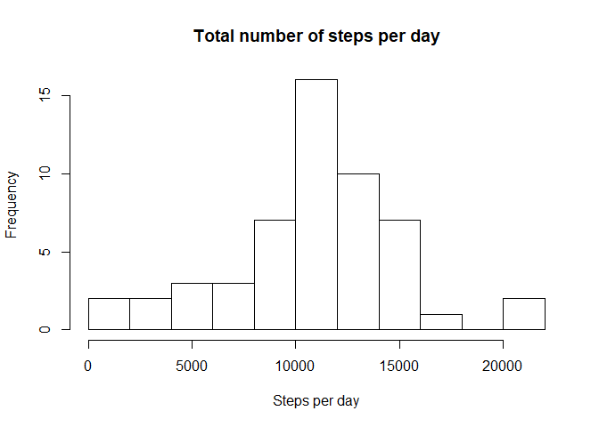
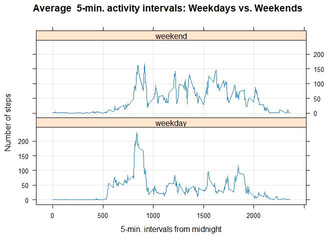

library(dplyr)

## *Load data*
Downloading data from the provided URL

```r
if (!file.exists("activity.csv") )
{
  url1 <- 'http://d396qusza40orc.cloudfront.net/repdata%2Fdata%2Factivity.zip'  
  download.file(url1,destfile='repdata%2Fdata%2Factivity.zip',mode='wb')  
  unzip('repdata%2Fdata%2Factivity.zip')
}
```
## *Read data*
1. Code for reading in the dataset and/or processing the data

```r
data <- read.csv("activity.csv")
str(data)
```

```
## 'data.frame':	17568 obs. of  3 variables:
##  $ steps   : int  NA NA NA NA NA NA NA NA NA NA ...
##  $ date    : Factor w/ 61 levels "2012-10-01","2012-10-02",..: 1 1 1 1 1 1 1 1 1 1 ...
##  $ interval: int  0 5 10 15 20 25 30 35 40 45 ...
```
## *Steps taken per day*

```r
steps_by_day <- aggregate(steps ~ date, data, sum)
summary(steps_by_day)
```

```
##          date        steps      
##  2012-10-02: 1   Min.   :   41  
##  2012-10-03: 1   1st Qu.: 8841  
##  2012-10-04: 1   Median :10765  
##  2012-10-05: 1   Mean   :10766  
##  2012-10-06: 1   3rd Qu.:13294  
##  2012-10-07: 1   Max.   :21194  
##  (Other)   :47
```

# *Histogram - total steps taken each day*
2.Histogram of the total number of steps taken each day

```r
hist(steps_by_day$steps, breaks=10, main="Total number of steps per day", xlab="Steps per day")
```

<!-- -->

# *Mean & Median - steps taken each day*
3. Mean and median number of steps taken each day

```r
summary(steps_by_day)
```

```
##          date        steps      
##  2012-10-02: 1   Min.   :   41  
##  2012-10-03: 1   1st Qu.: 8841  
##  2012-10-04: 1   Median :10765  
##  2012-10-05: 1   Mean   :10766  
##  2012-10-06: 1   3rd Qu.:13294  
##  2012-10-07: 1   Max.   :21194  
##  (Other)   :47
```

## *Average daily activity pattern*

```r
steps_by_interval <- aggregate(steps ~ interval, data, mean)
summary(steps_by_interval$steps)
```

```
##    Min. 1st Qu.  Median    Mean 3rd Qu.    Max. 
##   0.000   2.486  34.113  37.383  52.835 206.170
```

# *Plot*
4. Time series plot of the average number of steps taken

```r
plot(steps_by_interval$interval,steps_by_interval$steps, type="l", xlab="Interval", ylab="Number of Steps",main="Average Number of Steps per Day by Interval")
```

<!-- -->

### *Find row - max of steps*
Row having max steps

```r
max_steps_row <- which.max(steps_by_interval$steps)
max_steps_row 
```

```
## [1] 104
```

## *Find interval - max steps*
5. The 5-minute interval that, on average, contains the maximum number of steps

```r
steps_by_interval[max_steps_row, ]
```

```
##     interval    steps
## 104      835 206.1698
```

## *Total no. of missing values in the dataset*
6. Code to describe and show a strategy for imputing missing data

```r
sum(is.na(data$steps))
```

```
## [1] 2304
```

```r
sum(is.na(data$date))
```

```
## [1] 0
```

```r
sum(is.na(data$interval))
```

```
## [1] 0
```

## *Raplace NAs*
To replace NAs in the dataset

```r
sum(is.na(steps_by_interval$mean.steps))
```

```
## [1] 0
```

```r
data_imputed <- data
for (i in 1:nrow(data_imputed)) {
  if (is.na(data_imputed$steps[i])) {
    interval_value <- data_imputed$interval[i]
    steps_value <- steps_by_interval[
      steps_by_interval$interval == interval_value,]
    data_imputed$steps[i] <- steps_value$steps
  }
}
head(data_imputed)
```

```
##       steps       date interval
## 1 1.7169811 2012-10-01        0
## 2 0.3396226 2012-10-01        5
## 3 0.1320755 2012-10-01       10
## 4 0.1509434 2012-10-01       15
## 5 0.0754717 2012-10-01       20
## 6 2.0943396 2012-10-01       25
```
## *Calculate  total number of steps taken each day*

```r
df_imputed_steps_by_day <- aggregate(steps ~ date, data_imputed, sum)
head(df_imputed_steps_by_day)
```

```
##         date    steps
## 1 2012-10-01 10766.19
## 2 2012-10-02   126.00
## 3 2012-10-03 11352.00
## 4 2012-10-04 12116.00
## 5 2012-10-05 13294.00
## 6 2012-10-06 15420.00
```

## *Histogram*
7. Histogram of the total number of steps taken each day after missing values are imputed

```r
hist(df_imputed_steps_by_day$steps, main="Histogram of total number of steps per day (imputed)", 
     xlab="Total number of steps in a day")
```

<!-- -->
## *To get mean and median of imputed data*

```r
mean(df_imputed_steps_by_day$steps)
```

```
## [1] 10766.19
```

```r
median(df_imputed_steps_by_day$steps)
```

```
## [1] 10766.19
```

## *get mean and median of data with NA's*
Mean and median with NAs for comparison 

```r
summary(steps_by_day)
```

```
##          date        steps      
##  2012-10-02: 1   Min.   :   41  
##  2012-10-03: 1   1st Qu.: 8841  
##  2012-10-04: 1   Median :10765  
##  2012-10-05: 1   Mean   :10766  
##  2012-10-06: 1   3rd Qu.:13294  
##  2012-10-07: 1   Max.   :21194  
##  (Other)   :47
```
## [Mean values stays the same but therer is slight difference in meadian value.]

## *Differences in activity patterns between weekdays and* weekends

```r
data_imputed['type_of_day'] <- weekdays(as.Date(data_imputed$date))
data_imputed$type_of_day[data_imputed$type_of_day  %in% c('Saturday','Sunday') ] <- "weekend"
data_imputed$type_of_day[data_imputed$type_of_day != "weekend"] <- "weekday"
```
### **Convert type_of_day from character to factor*

```r
data_imputed$type_of_day <- as.factor(data_imputed$type_of_day)
```
## *Calculate average steps by interval across all days*

```r
df_imputed_steps_by_interval <- aggregate(steps ~ interval + type_of_day, data_imputed, mean)
```
## Create a plot
8. Panel plot comparing the average number of steps taken per 5-minute interval across weekdays and weekends

```r
data_imputed$day <- "weekday"
data_imputed$day[weekdays(as.Date(data_imputed$date), abb=T) %in% c("Sat","Sun")] <- "weekend"

table(data_imputed$day)
```

```
## 
## weekday weekend 
##   12960    4608
```

```r
##A panel plot containing a time series plot 
library(lattice)
meanStepsPerIntervalNoMissingDay <- aggregate(steps ~ interval + day, data=data_imputed, FUN="mean")
xyplot(steps ~ interval | day, data=meanStepsPerIntervalNoMissingDay, type="l", grid=T, layout=c(1,2), ylab="Number of steps", xlab="5-min. intervals from midnight", main="Average  5-min. activity intervals: Weekdays vs. Weekends")
```

<!-- -->
